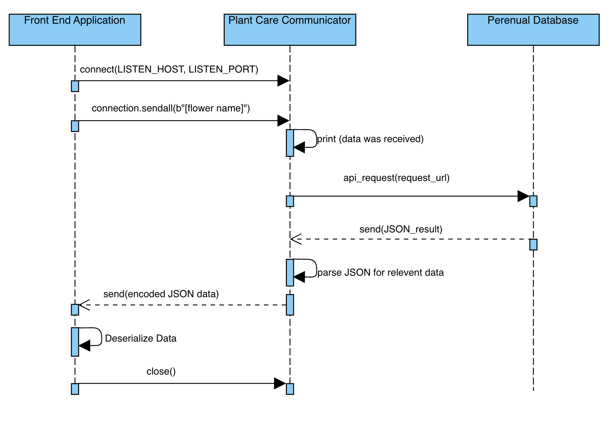

# Plant Care Communicator

## Overview
The Plant Care Communicator is a tool that facilitates communication between a front end program that allows users to search for information on how to care for plants and a back end database that contains all of the plant care information. While this project was designed for plant care. In theory, this tool can be used and modified to communicate between any front end service and back end database.

The tool is implemented via the file plantCareCommunicator.py. This repository also comes with two files that allow you to simulate the front and back end (named front_end_simulator.py and back_end_simulator.py respectively). While these files are not part of the tool, they provide a framwork to test the communication between the front and back ends.

## Sending Data to the Microservice

Data is sent to the Plant Care Communicator by sending the name of the plant to the IP address and port specified in the plantCareCommunicator.py file. By default these values are set to:
   
    LISTEN_HOST = "127.0.0.1"
    LISTEN_PORT = 4444

If you want to have the microservice running on a computer seperate from where the front end is running, then you can change LISTEN_HOST to the remote IP address of the computer the microservice is running on. The LISTEN_PORT can be changed to any port that you want the microservice to listen on. Once the desired values for LISTEN_HOST and LISTEN_PORT are set, simply send the data from the front end to the specified IP address and port. Data should be sent as a bytestring. For example, in Python, if you wanted to retrieve data for Chrysanthemums, this should be formatted as:
    data = b"chrysanthemum"
While the Plant Care Communicator is written in Python, the open port is listening for data agnostic of the language the data was sent from. This tool is compatible with any programming language, provided that programming languge can send a bytestring to the remote host.

## Receiving Data from the Microservice

Data recieved by the front end is turned into a format the back end can understand and then a request for data based on the plant name is sent to the back end. This allows users on the front end to enter human readable names. The communication with the back end occurs via Python sockets. The remote IP address and port of the back end can be specified if it is not running on the same computer as the Plant Care Communicator. By default, these values are set to:
    
    BACK_END_HOST = "127.0.0.1"
    BACK_END_PORT = 5555

The tool sends the plant name to the back end which returs the data associated with that plant. The back end responds with a dictionary. In order for a dictionary to be passed over sockets, it needs to be serialized. This is done with the python pickle library. The dictionary will need to be deserialized in the front end application to receive human readable data. 

##UML Sequence Diagram
