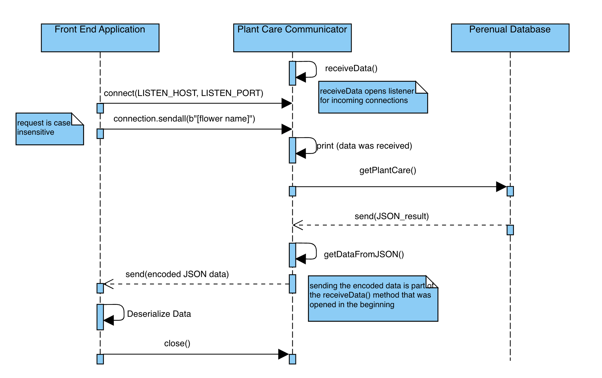

# Plant Care Communicator

## Overview
The Plant Care Communicator is a tool that facilitates communication between a front end program that allows users to search for information on how to care for plants and a back end database that contains all of the plant care information. This tool utilizes an the API found at https://perenual.com/docs/api where you can find more information about interacting with their database.

The tool is implemented via the file plantCareCommunicator.py. This repository also comes with a file that simulates the front end user called front_end_simulator.py. While this file is not a part of the tool, it provides a convienient way to simulate a front end user. 

## Sending Data to the Microservice

Data is sent to the Plant Care Communicator by sending the name of the plant to the IP address and port specified in the plantCareCommunicator.py file. By default these values are set to:
   
    LISTEN_HOST = "127.0.0.1"
    LISTEN_PORT = 4444

If you want to have the microservice running on a computer seperate from where the front end is running, then you can change LISTEN_HOST to the remote IP address of the computer the microservice is running on. The LISTEN_PORT can be changed to any port that you want the microservice to listen on. Once the desired values for LISTEN_HOST and LISTEN_PORT are set, simply send the data from the front end to the specified IP address and port. Data should be sent as a bytestring. For example, in Python, if you wanted to retrieve data for Chrysanthemums, this should be formatted as:

    data = b"chrysanthemum"
    -OR-
    data = b"European Silver Fir"

Note that is is perfectly acceptable to send plant names with spaces. The tool will properly encode the URL request (which is discussed in the Receiving Data From the Microservice section). While the Plant Care Communicator is written in Python, the open port is listening for data agnostic of the language the data was sent from. This tool is compatible with any programming language, provided that programming languge can send a bytestring to the remote host.

## Receiving Data from the Microservice

Data recieved from the front end is turned into a format the back end can understand and then a request for data based on the plant name is sent to the back end. This is done through a URL request via the Perenual API. The URL requires an API key and a plant name in order to return data. (In order to avoid publishing api keys to online repositories, you will need to get your own API key to make this work. There will be instructions in the .env Setup section below). The url is defined in the following line in the PlantCareCommunicator.py file:

    url = f"https://perenual.com/api/species-care-guide-list?key={os.getenv('api_key')}&q={plantName}"

The plant name is part of the URL, however the front end user does not need to worky about encoding the name in URL format. It is acceptable to send a plant name that contains spaces. The Plant Care Communicator will take care of encoding the request properly. The back end returns data in JSON format. The tool parses the JSON and returns the relevent information to the front end via the initial connection. The data sent from the Plant Care Communicator is a JSON string. It must be encoded in order to be sent over the socket so it will need to be decoded by the front end.

## .env File Setup

In order to avoid publisihing api keys, this tool utilizes the python-dotenv library to set up the API key. This creates a .env file where API keys can be stored and then they are called from the main program. The first thing you need to do is to make sure that the python-dotenv library is installed. To do this run the following command:

    pip3 install python-dotenv

Once installed, create a file called .env (there is an example file in the repository). If you use the example file, just remove the _example from the end of the filename. In the .env file, create a variable called api_key. This variable is what is called in the main tool. You will need to replace this value with your API key. The value should not be in quotes. It should look something like this:

    api_key=thIsisMyApiKey0325cb45f2a4

This variable should not be renamed unless you update the name in the main tool. All of the required import statements and calls are already set up in the main python program, however, for reference, these import statements are:

    from dotenv import load_dotenv
    import os

The import os is required to reference the .env file in the url call via the command os.getenv('api_key'). If you decide to change the name of the api key variable in the .env file, it must be updated here.

## UML Sequence Diagram

